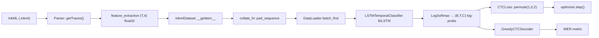

# 🧠 Master Open-Book Exam Cheatsheet — AI & Deep Learning
> 50 MCQ · Open Book · Merged from code/architecture notes + conceptual trap matrices.
> Every subsection = code/math + its exact MCQ trap, together. Skim the **1-Second Look-up Table** at the top of each module first; drill into subsections only if you need the "why."

## 🗺️ Module Index

| # | Module | Core Topics |
|---|---|---|
| 1 | NumPy & Pandas Foundations | shape/axis, reshape, fancy indexing, `loc`/`iloc`, sorting, matmul |
| 2 | ML Paradigms & Data Splits | supervised/unsupervised, tabular vs unstructured, train/val/test rules |
| 3 | DL Core & Activations | neuron math, backprop, activation + loss matrices |
| 4 | PyTorch Workflow & Training | training loop, autograd modes, optimizers, hyperparameters |
| 5 | CNNs | conv output size, parameter counting, pooling |
| 6 | RNN & Sequential Modeling | BPTT, vanishing gradient, BiLSTM, encoder-decoder |
| 7 | CTC & Projects | alignment, blank token, WER, CROHME pipeline |
| 8 | Master FALSE Index | top 25 rapid-fire traps + glossary |

---

## 🧩 MODULE 1 — NumPy & Pandas Foundations

### 1-Second Look-up Table

| Op | Result / Rule | ⚠ Trap |
|---|---|---|
| `a.shape` on `[[1,2,3],[4,5,6]]` | `(2,3)` = (axis0 rows, axis1 cols) | shape order is (rows, cols), not (cols, rows) |
| `axis=0` | collapses **rows** → one value per **column** | commonly mis-read as "row-wise" |
| `axis=1` | collapses **cols** → one value per **row** | |
| `a.sum(axis=0)` on `[[1,2],[3,4]]` | `[4, 6]` | people expect row sums, get column sums |
| `np.argmax(a)` | flat **index** of max, not the value | `np.max` → value, `np.argmax` → index |
| `np.sort` vs `np.argsort` | sort→values, argsort→**indices** that would sort | |
| `a.flatten()` vs `a.ravel()` | flatten **always copies**; ravel returns a **view** when possible | mutating a ravel() view can mutate the original array |
| `a[:, np.newaxis]` on shape `(3,)` | → `(3,1)` | `np.newaxis is None` |
| `df.iloc[0:3]` | **excludes** index 3 (Python-style) | |
| `df.loc['a':'c']` | **includes** `'c'` (label-based, inclusive) | opposite of `iloc`! |
| NumPy array dtype | **homogeneous** — all elements same dtype | "NumPy arrays can hold mixed types" — FALSE, that's Python lists |
| Broadcast `(3,4)+(4,)` | OK → `(4,)` treated as `(1,4)` | `(3,4)+(3,)` **fails** unless reshaped to `(3,1)` |
| MatMul `[m,n]·[n,p]` | → `[m,p]`, inner dims must match | `[3,3]@[5,3]` → **ERROR** (3≠5) |

---

### 1.1 Shape, ndim, size & Axis Direction

```python
a = np.array([[1, 2, 3], [4, 5, 6]])   # shape (2, 3)
a.shape   # (2, 3) — (axis0=rows, axis1=cols)
a.ndim    # 2
a.size    # 6
a.sum(axis=0)   # [5, 7, 9]  — sum each COLUMN (collapse rows)
a.sum(axis=1)   # [6, 15]    — sum each ROW (collapse cols)
```

Axis convention for a 3D shape `(2, 4, 3)`:

```
Shape: (2, 4, 3)
        │  │  │
        │  │  └─ axis=2 (last dim, axis=-1)
        │  └──── axis=1
        └─────── axis=0 (first dim)
```

**Axis = "which dimension gets collapsed."** `axis=0` collapses rows (produces one value per column); `axis=1` collapses columns.

> ⚠ **TRAP:** "`a.sum(axis=0)` sums each row" — FALSE. `axis=0` sums **down** each column, producing one value per column.

---

### 1.2 Reshape / Flatten / Ravel

```python
a = np.arange(12)
a.reshape(3, 4)     # (3,4)
a.reshape(2, 6)
a.reshape(2, 2, 3)  # 3D: (2,2,3)
a.reshape(-1)       # flatten to 1D
a.reshape(3, -1)    # (3,4) — auto-computed dim
a.flatten()         # 1D, ALWAYS a copy
a.ravel()           # 1D, view when possible (no copy)
```

> ⚠ **TRAP:** Rule: total element count must be preserved. `(12,)` → `(3,4)`, `(2,6)`, `(2,2,3)` all valid (12 elements each); `(12,)` → `(5,3)` invalid (15≠12).
> ⚠ **TRAP:** `.flatten()` is safe to mutate independently; `.ravel()`'s output can be a **view**, so mutating it can silently mutate the original array.

---

### 1.3 Transpose / Permute

```python
a = np.array([[1,2,3],[4,5,6]])   # (2,3)
a.T                # (3,2) — rows become cols
a.transpose()      # same as .T for 2D

b = np.zeros((2, 3, 4))
b.transpose(2, 0, 1)   # shape → (4, 2, 3) — reorder axes
```

PyTorch equivalent: `x.permute(1,0,2)` reorders a `(B,T,C)` tensor to `(T,B,C)` — this exact operation is **required** before `nn.CTCLoss` (Module 7).

> ⚠ **TRAP:** `.T` / `.transpose()` / `.permute()` reorder axes but do **not** change underlying data — the result may not be contiguous in memory. PyTorch's `.view()` requires contiguous memory; `.reshape()` does not (it copies if needed).

---

### 1.4 Element-wise Ops & Broadcasting

```python
a = np.array([1, 2, 3]); b = np.array([10, 20, 30])
a + b     # [11, 22, 33]
a * b     # [10, 40, 90]
a ** 2    # [1, 4, 9]
np.sqrt(a); np.exp(a); np.log(a)
```

**Broadcasting rule** — align shapes from the **right**; compatible if dims are equal, or one of them is `1`:

```
(3,4) + (4,)   → OK: (4,) treated as (1,4) → broadcasts to (3,4)
(3,1) + (1,4)  → OK: → result (3,4)
(3,)  + (3,)   → OK: same shape
(3,)  + (4,)   → ERROR: incompatible
(3,4) + (3,)   → ERROR unless reshaped to (3,1)
```

```python
row = np.array([1, 2, 3])[:, np.newaxis]         # (3,1)
col = np.array([10, 20, 30, 40])[np.newaxis, :]  # (1,4)
row + col   # (3,4) — outer sum
```

> ⚠ **TRAP:** `np.newaxis is None` — `a[None, :]` ≡ `a[np.newaxis, :]`.
> ⚠ **TRAP:** `shape (3,4) + shape (3,)` does **not** broadcast automatically; you must reshape `(3,)` → `(3,1)` first.

---

### 1.5 Indexing (Basic, Fancy, `np.where`)

```python
a = np.array([[10, 20, 30], [40, 50, 60]])
a[0]        # [10, 20, 30] — first row
a[1, 2]     # 60
a[:, 1]     # [20, 50] — all rows, col 1
a[0:2, 1:]  # [[20,30],[50,60]]

idx = np.array([0, 2, 4])
vals = np.array([100, 200, 300, 400, 500])
vals[idx]              # [100, 300, 500] — fancy indexing

mat = np.arange(12).reshape(3, 4)
mat[[0, 2], [1, 3]]     # [mat[0,1], mat[2,3]] = [1, 11] — paired, NOT a grid!

a = np.array([1, -2, 3, -4, 5])
np.where(a > 0)         # (array([0, 2, 4]),) — TUPLE of index arrays
np.where(a > 0)[0]      # [0, 2, 4]
np.where(a > 0, a, 0)   # ternary: [1, 0, 3, 0, 5]
```

> ⚠ **TRAP:** Fancy indexing `mat[rows, cols]` zips element-wise (NOT a cross-product) — `mat[[0,2],[1,3]]` returns **2** values, not 4.
> ⚠ **TRAP:** `np.where(condition)` alone returns a **tuple of arrays** (one per dimension), not a flat array of indices.

---

### 1.6 Aggregation, `argmax`/`argmin`

```python
a = np.array([[3, 1, 4], [1, 5, 9]])
np.max(a); np.sum(a); np.mean(a)
np.max(a, axis=0)   # [3, 5, 9] — per-column max
np.max(a, axis=1)   # [4, 9]    — per-row max
np.argmax(a)        # 5 — FLAT INDEX of global max (value 9)
np.argmax(a, axis=1) # [2, 2] — col-index of the max within each row
```

> ⚠ **TRAP:** `argmax`/`argmin` return the **index** of the extreme value, never the value itself. Same logic drives CTC greedy decoding (Module 7): `emission.argmax(dim=-1)` gives the predicted class index per timestep, not a probability.

---

### 1.7 Sorting: `sort` vs `argsort`

```python
a = np.array([3, 1, 4, 1, 5, 9, 2])
np.sort(a)      # [1,1,2,3,4,5,9]  — VALUES
np.argsort(a)   # [1,3,6,0,2,4,5]  — INDICES that would sort a

mat = np.array([[3,1],[2,4]])
np.sort(mat, axis=0)   # sort each column
np.sort(mat, axis=1)   # sort each row

# top-k pattern
idx = np.argsort(a)[::-1]   # descending indices
a[idx[:2]]                  # top-2 values
```

> ⚠ **TRAP:** `np.sort` returns sorted **values**; `np.argsort` returns the sorting **positions**. Confusing the two is a classic distractor.

---

### 1.8 Concatenation

```python
a = np.array([[1, 2], [3, 4]])   # (2,2)
b = np.array([[5, 6], [7, 8]])   # (2,2)
np.concatenate([a, b], axis=0)   # stack rows → (4,2)
np.concatenate([a, b], axis=1)   # stack cols → (2,4)
np.vstack([a, b])   # == axis=0 → (4,2)
np.hstack([a, b])   # == axis=1 → (2,4)
```

---

### 1.9 MatMul (Dot Product) Rule

```
Matrix A: [m × n] · Matrix B: [n × p] → Result: [m × p]
                  └── inner dims must match ──┘   └ outer dims ┘
```

> ⚠ **TRAP:** `[3,3] @ [3,2]` → `[3,2]` (valid). `[3,3] @ [5,3]` → **ERROR** — inner dims 3 ≠ 5 don't match.

---

### 1.10 Pandas: `loc` vs `iloc`, DataFrame Basics, Concat

```python
df = pd.DataFrame({'A':[10,20,30], 'B':[40,50,60]}, index=['x','y','z'])
df.shape          # (3, 2)
df.iloc[0]        # position 0 → row 'x': A=10, B=40
df.iloc[0, 1]     # row 0, col 1 → 40
df.iloc[0:2]      # rows 0,1 — EXCLUDES 2 (Python slicing)
df.iloc[[0, 2], 1]  # rows 0 & 2, col 1 → [40, 60]

df.loc['x']         # label 'x'
df.loc['x', 'B']    # 40
df.loc['x':'y']     # INCLUDES both endpoints (label slicing)
df.loc[df['A'] > 10]  # boolean indexing
```

| | `iloc` | `loc` |
|---|---|---|
| Basis | integer position | label / boolean |
| Slice end | **exclusive** (Python-style) | **inclusive** |
| Example | `df.iloc[0:2]` → rows 0,1 | `df.loc['x':'y']` → x **and** y |

> ⚠ **TRAP:** This asymmetry (`iloc` exclusive vs `loc` inclusive) is one of the most-tested facts in the whole course.

```python
pd.concat([df1, df2])                       # axis=0 default — stack rows
pd.concat([df1, df2], ignore_index=True)    # resets index to 0,1,2,3...
pd.concat([df1, df3], axis=1)               # side-by-side columns
```

---

### 1.11 Tensor Dimension Vocabulary & Data Shape Conventions

| Object | ndim | Shape example |
|---|---|---|
| Scalar | 0 | `[]` |
| Vector | 1 | `[n]` |
| Matrix | 2 | `[m, n]` |
| Tensor | n | `[d1, d2, ..., dn]` |

| Data | Shape convention |
|---|---|
| Grayscale image | `[H,W]` or `[1,H,W]` |
| RGB image (single) | `[3,H,W]` (PyTorch NCHW) or `[H,W,3]` (TensorFlow NHWC) |
| Batch of RGB images | `[B,3,H,W]` |
| Audio (single) | `[Time]` or `[Time, Channels]` |
| Text tokens (batch) | `[B, SeqLen]` |
| Tabular data (batch) | `[B, Features]` |

`reshape` (copies if needed, always works) vs `view` (needs contiguous memory, PyTorch-only) vs `transpose`/`permute` (reorders axes, no data change) vs `flatten` (→1D).

> ⚠ **TRAP:** NHWC → NCHW conversion is `permute(0, 3, 1, 2)` — an axis reorder, not a reshape.

---

## 🤖 MODULE 2 — ML Paradigms & Data Splits

### 1-Second Look-up Table

| Concept | Rule | ⚠ Trap |
|---|---|---|
| Supervised | needs labels `(X, y)` | |
| Unsupervised | no labels, finds structure | |
| Train set | model **weights** update here | |
| Validation set | tune hyperparams + early stopping | model DOES "see" this data (for eval, not weight updates) — "never seen during training" is FALSE |
| Test set | final unbiased eval, used **once** | using it to pick a checkpoint = contamination |
| DL vs traditional ML | DL wins on unstructured (image/text/audio); traditional ML often wins on tabular | "DL always beats traditional ML" — FALSE |
| F1-score | harmonic mean of **precision & recall** | NOT "accuracy and precision" |

---

### 2.1 Supervised vs Unsupervised

| | Supervised | Unsupervised |
|---|---|---|
| Training data | labeled `(X, y)` | unlabeled (X only) |
| Goal | learn X → y mapping | find patterns / structure |
| Examples | Classification, Regression | Clustering, PCA |
| Evaluation | Accuracy, MSE, WER | Silhouette score, reconstruction error |

| Type | Goal | Output | Example |
|---|---|---|---|
| Classification | assign a **category** | discrete label | spam detection, digit recognition |
| Regression | predict a **number** | continuous value | house price, temperature |
| Clustering | **group** similar data | cluster IDs | customer segmentation |

---

### 2.2 Applications (MCQ Favorites)

| Problem | Type | Algorithm |
|---|---|---|
| Email spam detection | Classification | Logistic Regression, SVM |
| House price prediction | Regression | Linear Regression, NN |
| Customer grouping | Clustering | K-Means |
| Image recognition | Classification | CNN |
| Stock price prediction | Regression + time-series | RNN, LSTM |
| Handwriting recognition | Sequence classification | BiLSTM + CTC ✅ |

---

### 2.3 Traditional ML vs Deep Learning vs Classic Programming

| | Traditional ML | Deep Learning | Classic Programming |
|---|---|---|---|
| Mechanism | shallow algos: Random Forest, GBM, SVM, Naive Bayes, k-NN | neural nets: FCNN, CNN, RNN, Transformer | human writes explicit rules |
| Best for | structured/tabular data; interpretability | unstructured data: images, text, audio | deterministic problems |
| Paradigm | — | **Data + Answers → Rules** (model learns rules) | **Rules + Data → Answers** |

> ⚠ **TRAP:** "Deep learning always outperforms traditional ML" — FALSE; traditional ML is frequently superior on structured/tabular data. Rule #1 of applied ML: if a simple rule-based system solves it, skip ML entirely.

---

### 2.4 Dataset Splits: Roles & Rules

```
All Data
├── Train (70–80%)       → weights updated here via gradient descent
├── Validation (10–15%)  → hyperparameter tuning, early stopping, checkpoint selection
└── Test (10–15%)        → FINAL evaluation ONLY — touched exactly once
```

| Set | Seen during training? | Used for |
|---|---|---|
| Train | Yes — drives weight updates | learning patterns; overfitting = great here, poor elsewhere |
| Validation | Yes — for **evaluation**, not weight updates | model selection, early stopping |
| Test | **Never** until the very end | unbiased final performance estimate |

> ⚠ **TRAP:** "The validation set is never seen during training" — FALSE. It IS seen (evaluated every epoch), just never used to update weights.
> ⚠ **TRAP:** "Use the test set to select the best checkpoint" — FALSE. That's the validation set's job. Any decision made from test-set performance **contaminates** the unbiased estimate — think of the test set as the "final exam: see if the model is ready for the wild," used once.

---

### 2.5 Overfitting / Underfitting & Early Stopping

```
Training Loss:  ↓↓↓↓↓↓↓↓↓↓  (keeps dropping)
Val Loss:       ↓↓↓↓ then ↑↑↑↑   ← rising val loss = overfitting begins
```

| Failure | Sign | Fix |
|---|---|---|
| Overfitting | train loss ↓, val loss ↑ | dropout, regularization, early stopping, more data, augmentation |
| Underfitting | high loss on **both** train and val | more capacity (layers/units), more epochs, less regularization |

```python
best_val_loss = float('inf'); patience = 5; wait = 0
for epoch in range(num_epochs):
    model.train()
    for batch in train_loader:
        optimizer.zero_grad(); loss.backward(); optimizer.step()
    model.eval()
    with torch.no_grad():
        val_loss = evaluate_model(...)['loss']
    if val_loss < best_val_loss - min_delta:
        best_val_loss, wait = val_loss, 0
        torch.save(model.state_dict(), 'best_model.pt')   # checkpoint
    else:
        wait += 1
        if wait >= patience:
            print("Early stopping triggered!"); break
```

> ⚠ **TRAP:** Early stopping triggers on **validation** loss, never training loss.

---

### 2.6 Classification Metrics Quick Note

$$F1 = \frac{2 \times \text{Precision} \times \text{Recall}}{\text{Precision} + \text{Recall}}$$

F1 is the harmonic mean of **precision and recall** — useful for imbalanced datasets where plain accuracy is misleading.

> ⚠ **TRAP:** "F1-score is the harmonic mean of accuracy and precision" — FALSE. It's precision **and recall**; accuracy is not part of the formula.

---

## 🧠 MODULE 3 — Deep Learning Core & Activation Functions

### 1-Second Look-up Table (Activation Matrix)

| Fn | Formula | Range | Zero-centered? | Differentiable everywhere? | Best for | ⚠ MCQ Trap |
|---|---|---|---|---|---|---|
| Sigmoid | $\frac{1}{1+e^{-x}}$ | $(0,1)$ | **No** | Yes | binary output layer | "Sigmoid is zero-centered" → FALSE; always positive → zigzag gradient updates; saturates → vanishing gradient |
| Tanh | $\frac{e^x-e^{-x}}{e^x+e^{-x}}$ | $(-1,1)$ | **Yes** | Yes | RNN hidden states (historically) | Zero-centered ≠ solves vanishing gradient — it still saturates and vanishes at extremes |
| ReLU | $\max(0,x)$ | $[0,\infty)$ | No | **No** (kink at $x{=}0$) | default for hidden layers (CNN/MLP) | "Differentiable everywhere" → FALSE; "dying ReLU" — neuron permanently outputs 0 if lr too high / bad init |
| Leaky ReLU | $x$ if $x>0$, else $\alpha x$ ($\alpha{=}0.01$) | $(-\infty,\infty)$ | ~No | No (kink at 0) | mitigating dying ReLU | non-zero gradient for $x<0$ — prevents **dead** neurons specifically |
| GELU | smooth Gaussian approximation of ReLU | ~$(-\infty,\infty)$ | No | Yes (smooth) | Transformers (BERT/GPT) | used in Transformers, **not** typically CNNs; don't confuse with Swish/SiLU |
| Linear (identity) | $x$ | $(-\infty,\infty)$ | Yes | Yes | regression output layer | stacking **only** linear layers collapses the whole network to a single linear transform |
| Softmax | $\frac{e^{x_i}}{\sum_j e^{x_j}}$ | $(0,1)$, sums to 1 | — | Yes | multi-class output | it's an **activation, not a loss**; `CrossEntropyLoss` already includes softmax — feed raw logits, not probabilities |
| LogSoftmax | $\log(\text{Softmax})$ | $(-\infty,0)$ | — | Yes | CTC / NLLLoss input | required by `nn.CTCLoss` (needs log-probabilities) |

---

### 3.1 The Neuron, Layers & Universal Approximation

```
Input Layer → Hidden Layer(s) → Output Layer
  x₁ ──┐
  x₂ ──┼─→ [Hidden 1] → [Hidden 2] → [Output] → ŷ
  x₃ ──┘
```

$$z = w_1x_1 + w_2x_2 + \dots + w_nx_n + b = \mathbf{w}^T\mathbf{x} + b, \qquad \hat y = \text{activation}(z)$$

- Weight $w_i$: how much feature $x_i$ matters. Bias $b$: shifts the activation threshold. Both are learned via backprop.

```python
layer = nn.Linear(in_features=4, out_features=8)
# layer.weight: shape (8, 4)   layer.bias: shape (8,)
```

**Universal Approximation Theorem**: an MLP with **non-linear** activations can approximate any continuous function. Non-linearity is *required* for this to hold — depth alone is not enough.

> ⚠ **TRAP:** "A deep network with only linear activations can learn arbitrary non-linear functions" — FALSE. Stacked linear layers mathematically collapse into one equivalent linear transform, no matter how deep the network is.

---

### 3.2 Gradient Vector & Chain Rule (Backprop)

$$\nabla_\theta L = \left[\frac{\partial L}{\partial w_1}, \frac{\partial L}{\partial w_2}, \dots, \frac{\partial L}{\partial b}\right]$$

The gradient points toward steepest **ascent**; we step in the **opposite** direction to minimize loss.

For $\hat y = f(z) = f(wx+b)$:

$$\frac{\partial L}{\partial w} = \frac{\partial L}{\partial \hat y}\cdot\frac{\partial \hat y}{\partial z}\cdot\frac{\partial z}{\partial w}$$

```
Forward pass:  x → z → ŷ → L
Backward pass: ∂L/∂ŷ → ∂L/∂z → ∂L/∂w   (chain rule, applied backwards = backpropagation)
```

---

### 3.3 Weight Update (Gradient Descent)

$$w_{\text{new}} = w_{\text{old}} - \eta \cdot \frac{\partial L}{\partial w}$$

where $\eta$ = learning rate (step size control).

```python
optimizer = torch.optim.Adam(model.parameters(), lr=1e-3)
optimizer.zero_grad()   # clear old gradients
loss.backward()         # compute new gradients
optimizer.step()        # update weights
```

> ⚠ **TRAP:** ALWAYS call `zero_grad()` before `backward()` — otherwise gradients **accumulate** across batches (this is by design, not a bug).

---

### 3.4 Loss Functions Matrix

| Loss | Mechanism | Best for | ⚠ MCQ Trap |
|---|---|---|---|
| **MSELoss (L2)** | $(y_{pred}-y_{true})^2$ | regression, normally-distributed errors | sensitive to outliers (squared term); wrong choice for classification |
| **L1Loss (MAE)** | $\lvert y_{pred}-y_{true}\rvert$ | regression with outliers present | more robust than MSE but constant gradient magnitude → slower convergence near the optimum |
| **BCEWithLogitsLoss** | Sigmoid + BCE fused | binary classification (spam/not-spam) | numerically stable; do **NOT** apply sigmoid before it — that's a double-sigmoid bug |
| **CrossEntropyLoss** | LogSoftmax + NLLLoss fused | multi-class (≥3 classes) | expects **raw logits** `[N, num_classes]` + **class-index** targets `[N]` (NOT one-hot); applying softmax first double-softmaxes and breaks gradients |
| **NLLLoss** | Negative Log-Likelihood | multi-class, after a LogSoftmax layer | expects **log-probabilities**, not raw logits |
| **CTC Loss** | aligns variable-length input sequence to output labels with no explicit alignment | handwriting recognition, speech recognition | does **NOT** require one-to-one input/output alignment — see Module 7 |

---

### 3.5 Normalization & Regularization

| Mechanism | What it does | Train vs Eval behavior | ⚠ MCQ Trap |
|---|---|---|---|
| **Batch Normalization** | normalizes activations across the batch dim ($\mu,\sigma$ per channel) | **train**: uses batch statistics · **eval**: uses running averages | "BatchNorm uses batch statistics during inference" — FALSE |
| **Dropout** | randomly zeroes a fraction $p$ of neurons | **train only** — fully OFF at eval (all neurons active) | "Dropout is applied during both training and inference" — FALSE; dropout $>0.5$ rarely used |
| **Layer Normalization** | normalizes across the feature dimension, per sample | identical behavior train/eval | independent of batch size → good fit for NLP/Transformers where batch size varies |

---

## 🔥 MODULE 4 — PyTorch Workflow, Autograd & Training Optimization

### 1-Second Look-up Table

| Item | Fact | ⚠ Trap |
|---|---|---|
| Training loop order | `zero_grad → forward → loss → backward → step` | `.step()` before `.backward()` = no gradients exist; `.backward()` before loss = fails |
| `model.train()` | dropout ON, BatchNorm uses batch stats, grad tracked | |
| `model.eval()` | dropout OFF, BatchNorm uses running avg, **grad STILL tracked** | "`model.eval()` disables gradient computation" — FALSE |
| `torch.no_grad()` | disables grad tracking; does **not** touch model mode | must combine with `.eval()` for correct evaluation |
| `torch.inference_mode()` | like `no_grad` but faster / more aggressive | preferred for pure inference/testing |
| `loss.backward()` | needs a **scalar** (0-d) loss | non-scalar → call `.mean()` first, or pass a `gradient=` argument |
| `retain_graph=True` | keeps the computation graph alive after backward | default: graph is freed after one `.backward()` call to save memory |
| Conv2d params | `in_ch × out_ch × k²` (+ `out_ch` bias) | see Module 5 |
| Pooling params | **zero** learnable parameters | see Module 5 |

---

### 4.1 PyTorch Tensor Basics & Device

```python
import torch, torch.nn as nn

t = torch.tensor([1.0, 2.0, 3.0])
t.shape     # torch.Size([3])
t.dtype     # torch.float32
t.device    # cpu

device = torch.device("cuda" if torch.cuda.is_available() else "cpu")
t = t.to(device)          # both model AND data must be on the SAME device

torch.zeros(3, 4); torch.ones(2, 3); torch.randn(5, 4); torch.arange(10)
```

---

### 4.2 Terminology: Sample, Batch, Epoch, Iteration

| Concept | Definition | Example |
|---|---|---|
| **Sample** | one data point | 1 ink expression |
| **Batch** | group of samples processed together | 32 expressions |
| **Epoch** | one full pass through ALL training data | 1000 samples / batch 32 ≈ 31 steps |
| **Iteration / Step** | one gradient update = one batch | 31 per epoch |

```
Dataset (1000 samples) → batch size 32 → ~31 batches per epoch
Epoch 1: step 1, step 2, ..., step 31
Epoch 2: step 1, step 2, ..., step 31   (data re-shuffled)
```

---

### 4.3 The Training Loop — Exact Order

```
for epoch in range(num_epochs):
    for batch in train_loader:
        optimizer.zero_grad()          # 1. MUST be first — reset grads
        y_pred = model(X)              # 2. forward pass
        loss = loss_fn(y_pred, y)      # 3. compute SCALAR loss
        loss.backward()                # 4. backprop — computes gradients
        optimizer.step()               # 5. update weights using gradients
```

> ⚠ **TRAP:** Omitting `zero_grad()` → gradients **accumulate** across batches → incorrect updates. Calling `.step()` before `.backward()` → no gradients exist yet to apply. Calling `.backward()` before the loss is computed → fails outright.

---

### 4.4 Evaluation Modes Compared

| Mode | Effect | Changes model mode? | Blocks autograd? |
|---|---|---|---|
| `model.train()` | dropout on, BN uses batch-stats | ✅ | ❌ (still tracks grad) |
| `model.eval()` | dropout off, BN uses running-stats | ✅ | ❌ (**still tracks grad!**) |
| `torch.no_grad()` | — | ❌ | ✅ |
| `torch.inference_mode()` | — | ❌ | ✅ (faster than `no_grad`) |

Correct evaluation pattern:

```python
model.eval()
with torch.no_grad():      # or torch.inference_mode()
    output = model(x)
```

> ⚠ **TRAP:** `model.eval()` alone does **not** stop gradient tracking — you still need `no_grad()` / `inference_mode()` layered on top.

---

### 4.5 `nn.Module` Requirements

- Must subclass `nn.Module`; must override `forward()`; must call `super().__init__()` inside `__init__`.
- Parameters (`nn.Parameter`, layer weights) default to `requires_grad=True` and are tracked by autograd.

> ⚠ **TRAP:** `model.forward(x)` works but **bypasses hooks**. Always call `model(x)` — this invokes `__call__`, which runs hooks and then `forward()`.

---

### 4.6 Autograd & Gradient Gotchas

- `.backward()` requires a **scalar** (0-d tensor). For a vector-valued loss: call `.mean()` first, or pass a matching `gradient=` argument.
- Gradient accumulation is **by design** — always `zero_grad()` between steps.
- `loss.backward(retain_graph=True)` keeps the graph alive so `.backward()` can be called again (e.g., multiple losses from one forward pass).
- `torch.isfinite(loss)` → `True` if the loss is not `nan`/`inf` (useful sanity check during training).

> ⚠ **TRAP:** "`backward()` can only be called once per computation graph" — TRUE only by default (graph is freed after one call to save memory); FALSE with `retain_graph=True`, which preserves it for reuse.

---

### 4.7 Weight Update / Gradient Descent Strategies

| Strategy | Update after... | Best for | ⚠ MCQ Trap |
|---|---|---|---|
| **Batch GD** | ALL samples | small datasets, convex optimization | expensive, memory-heavy per update; smooth but slow convergence |
| **Stochastic GD (SGD)** | EACH single sample | online learning, very large datasets | very noisy updates (high variance) but often better generalization; PyTorch's `SGD` optimizer usually means mini-batch SGD (+momentum) in practice |
| **Mini-batch GD** | each batch of $n$ samples (e.g. 32) | the standard default approach | smaller batch → noisier gradients, better generalization; larger batch → more stable, may generalize worse |
| **SGD + Momentum** | accumulates velocity from past gradients | faster convergence, escaping ravines | reduces zigzagging; does **NOT** guarantee finding the global minimum |

> ⚠ **TRAP:** "Stochastic gradient descent updates weights after processing a mini-batch" — FALSE. SGD updates after **each individual sample**; mini-batch GD is the distinct, separate category.

---

### 4.8 Hyperparameter "If X → Then Y" Scenarios

| Hyperparameter | Too Low / Small | Too High / Large | Sweet spot |
|---|---|---|---|
| Learning rate $\eta$ | slow convergence; may get stuck; needs more epochs | loss **explodes**/oscillates wildly, NaNs, may diverge | start high, **decay** over time (LR scheduling) |
| Batch size | noisy gradients, poor GPU utilization, **but better generalization** | stable but **worse generalization**, memory-intensive, sharp minima | 32 is the common sweet spot |
| Dropout rate | 0.0 → risk of overfitting on small data | > 0.7–0.9 → **extreme underfitting**, too few active neurons to learn | 0.5 is the standard starting point for FC layers |
| Epochs | **underfitting** (insufficient learning) | **overfitting** (train loss ↓, val loss ↑) | let early stopping decide |
| Model complexity (layers/units) | **underfitting** — insufficient capacity | **overfitting** — model memorizes training data | depth = hierarchical features, width = per-layer capacity |
| Data augmentation | none on a small dataset → high overfitting risk | too aggressive → model can't recognize original patterns → underfitting | goal: learn **invariant features** (robust to rotation/flip/zoom/shift) |

> ⚠ **TRAP:** Dropout is standard practice on **fully-connected layers**; it is far less common on convolutional layers.
> ⚠ **TRAP:** "A larger batch size always leads to better model performance" — FALSE. Larger batches give more stable gradients but often **worse generalization**; small-batch noise acts as implicit regularization, helping models find flatter, better-generalizing minima.

---

### 4.9 Dataset & DataLoader

```python
from torch.utils.data import Dataset, DataLoader

class MyDataset(Dataset):
    def __init__(self, ...):
        self.samples = [...]                  # list of (path, label) pairs
    def __len__(self):
        return len(self.samples)              # total number of samples
    def __getitem__(self, idx):
        return features_tensor, targets_tensor, input_len, target_len

loader = DataLoader(
    dataset, batch_size=32, shuffle=True,      # True for TRAIN, False for val/test
    collate_fn=collate_fn,                     # custom batching for variable-length seqs
    num_workers=0                              # 0 = no multiprocessing (safe in notebooks)
)
for batch in loader:
    features, targets, input_lens, target_lens = batch
```

- `Dataset` **must** implement `__len__()` and `__getitem__(idx)`.
- `shuffle=True`: critical for training (prevents learning batch-order artifacts); should be `False` for validation/test.

---

### 4.10 Variable-Length Sequences: `pad_sequence` & `collate_fn`

```python
from torch.nn.utils.rnn import pad_sequence

seq1 = torch.tensor([1.0, 2.0, 3.0])        # length 3
seq2 = torch.tensor([4.0, 5.0])              # length 2
seq3 = torch.tensor([6.0, 7.0, 8.0, 9.0])   # length 4

padded = pad_sequence([seq1, seq2, seq3], batch_first=True, padding_value=0)
# shape: (3, 4)
# [[1,2,3,0], [4,5,0,0], [6,7,8,9]]
```

```python
def collate_fn(batch):
    features_list, targets_list, input_lens_list, target_lens_list = zip(*batch)
    features_padded = pad_sequence(list(features_list), batch_first=True)   # (B, T_max, 4)
    targets_padded  = pad_sequence(list(targets_list), batch_first=True)    # (B, U_max)
    input_lens  = torch.tensor(input_lens_list,  dtype=torch.long)   # (B,)
    target_lens = torch.tensor(target_lens_list, dtype=torch.long)   # (B,)
    return features_padded, targets_padded, input_lens, target_lens
```

---

### 4.11 Saving & Loading Checkpoints

```python
torch.save({
    'epoch': epoch,
    'model_state_dict': model.state_dict(),
    'optimizer_state_dict': optimizer.state_dict(),
    'val_loss': val_loss,
}, 'checkpoint.pt')

checkpoint = torch.load('checkpoint.pt', map_location=device)
model.load_state_dict(checkpoint['model_state_dict'])
optimizer.load_state_dict(checkpoint['optimizer_state_dict'])
```

---

### 4.12 Key Tensor Ops Quick Reference

```python
# Permute (reorder axes)
x = torch.randn(2, 10, 5)      # (B, T, C)
x.permute(1, 0, 2)              # (T, B, C)

# Argmax
emission = torch.randn(10, 109)          # (T, C) log-probs
best_class = emission.argmax(dim=-1)     # (T,) — best class per timestep

# Unsqueeze / squeeze
x = torch.randn(3, 4)
x.unsqueeze(0)     # (1, 3, 4) — insert a dim
x.unsqueeze(-1)    # (3, 4, 1)

# .exp() on log-softmax output → probabilities (sanity check)
log_probs.exp().sum(dim=-1)     # should be all ≈ 1.0

# Check finite
torch.isfinite(loss)            # True if not nan/inf
```

---

### 4.13 GPU/Device & PyTorch Building Blocks Reference

| Module | Purpose |
|---|---|
| `torch.nn` | building blocks for computational graphs |
| `torch.nn.Module` | base class for ALL neural networks |
| `torch.nn.Parameter` | wrapper for tensors that should be learned |
| `torch.optim` | optimization algorithms (SGD, Adam, etc.) |
| `torch.utils.data.Dataset` | maps between key (label) and sample (features) pairs |
| `torch.utils.data.DataLoader` | Python iterable over a Dataset |
| `torchvision.transforms` | image preprocessing / augmentation pipeline |
| `torchvision.datasets` | pre-built datasets (FashionMNIST, etc.) |
| `torchvision.models` | pre-trained model architectures |

> ⚠ **TRAP:** The loss function's input tensors must be on the **same device** as the model's output — device mismatches are a common runtime error, not something PyTorch resolves automatically.

---

## 🧮 MODULE 5 — Convolutional Neural Networks (CNNs)

### 1-Second Look-up Table

| Item | Formula / Rule | ⚠ Trap |
|---|---|---|
| Conv2d param count | $C_{in}\times C_{out}\times K^2$ (+ $C_{out}$ bias) | forgetting the $C_{out}$ multiplier or the bias term |
| Output spatial size | $H_{out}=\lfloor\frac{H_{in}+2P-K}{S}+1\rfloor$ | stride defaults to **1**, but is often set higher |
| Weight sharing | same kernel slides across ALL spatial positions | NOT "unique weights per position" — that describes a fully-connected layer |
| Pooling params | **zero** learnable parameters (both max & avg) | |
| Max-pool backprop | gradient flows **only** through the max-activated neuron | opposite of avg-pool |
| Avg-pool backprop | gradient distributed **evenly** to all neurons in the window | opposite of max-pool |

---

### 5.1 Conv2d Parameter Counting

$$\text{Params} = C_{in}\times C_{out}\times K^2 \;\left(+\,C_{out}\text{ if bias}\right)$$

```python
nn.Conv2d(in_channels=3, out_channels=10, kernel_size=5, bias=True)
# = 3 × 10 × 5² + 10 = 750 + 10 = 760
```

> ⚠ **TRAP:** "Params = in_channels × kernel_size²" — FALSE, this omits the $C_{out}$ factor entirely — a favorite distractor.

---

### 5.2 Spatial Output Size

$$H_{out} = \left\lfloor \frac{H_{in} + 2P - D(K-1) - 1}{S} + 1 \right\rfloor \xrightarrow{D=1} \left\lfloor\frac{H_{in}+2P-K}{S}+1\right\rfloor$$

- `padding='same'` (stride=1): output size = input size.
- `padding='valid'` / `padding=0`: output size decreases.
- Stride=2, padding=0 → roughly **halves** spatial dimensions (standard downsampling).

> ⚠ **TRAP:** "Stride in Conv2d is always 1" — FALSE, it defaults to 1 but is very commonly set to 2+ for downsampling.

---

### 5.3 Weight Sharing

The **same filter** (kernel weights) is reused at every spatial position (sliding window) — this is what makes CNNs dramatically more parameter-efficient than a fully-connected layer over the same input.

> ⚠ **TRAP:** "Weight sharing means each neuron has unique weights per spatial position" — FALSE. That is the exact *opposite* of weight sharing.

---

### 5.4 Pooling: Max vs Average

| | Max Pooling | Average Pooling |
|---|---|---|
| Mechanism | max value in each window | mean value in each window |
| Learnable params | 0 | 0 |
| Backprop gradient routing | **only** to the max-activated neuron ("gradient routing") | distributed **evenly** across all neurons in the window |
| Typical use | dominant choice; downsampling + translation invariance | smoother downsampling, often just before the classifier head |

> ⚠ **TRAP:** "In max-pooling backprop, gradient is distributed equally to all neurons" — FALSE, that describes avg-pooling; the two mechanisms are direct opposites.

---

### 5.5 Tensor Shape Conventions

| Component | Shape | Notes |
|---|---|---|
| Image (PyTorch, NCHW) | `[B, C, H, W]` | channels-first (PyTorch default) |
| Image (TensorFlow, NHWC) | `[B, H, W, C]` | channels-last (TF default) |
| Conv2d input | `[N, C_in, H, W]` | 1=grayscale, 3=RGB |
| Conv2d output | `[N, C_out, H_out, W_out]` | H_out/W_out depend on stride & padding |
| Linear input | `[N, in_features]` | must **flatten** before a Linear layer |
| Classification output | `[N, num_classes]` | raw logits, pre-softmax |
| NHWC → NCHW | `permute(0, 3, 1, 2)` | axis reordering, not a reshape |

---

## 🔄 MODULE 6 — Recurrent Neural Networks & Sequential Modeling

### 1-Second Look-up Table

| Concept | Fact | ⚠ Trap |
|---|---|---|
| RNN context | sees only **past** (left-to-right) | |
| BiLSTM output size | `hidden_size × 2` (concat fwd + bwd) | `hidden=256` → output **512**, not 256 |
| LSTM gates | **3**: forget, input, output | "LSTM has 2 gates" — FALSE |
| Vanishing / exploding gradient | signal scales as $\lvert w\rvert^n$ over $n$ steps | $\lvert w\rvert{<}1$ → vanish, $\lvert w\rvert{>}1$ → explode |
| Bidirectional requirement | needs the **entire sequence** available up-front | unusable for real-time / autoregressive generation |
| BPTT | unroll the network across all $T$ steps, sum gradients | |

---

### 6.1 Sequential Data & Left-to-Right Context

Data where **order matters**: $x_1, x_2, \dots, x_T$ (stock prices, speech, handwriting strokes). One sample's feature shape: `(T, features)`, e.g. `(614, 4)` in the CROHME project.

$$h_t = f(W_h h_{t-1} + W_x x_t + b)$$

A standard (unidirectional) RNN only sees **past** context — it cannot look ahead:

```
x₁ → h₁ → x₂ → h₂ → x₃ → h₃ → ... → xT → hT → output
```

The **same weights** $W$ are reused at every timestep — weight sharing across time (this "unrolling" is what "unfolding an RNN" means).

---

### 6.2 Backpropagation Through Time (BPTT) & Vanishing/Exploding Gradients

$$\frac{\partial L}{\partial W} = \sum_{t=1}^{T}\frac{\partial L_t}{\partial W}$$

The gradient's influence from an early timestep scales roughly as $\lvert w\rvert^n$ across $n$ steps:

- $\lvert w\rvert < 1$ → gradient **vanishes** exponentially → can't learn long-range dependencies.
- $\lvert w\rvert > 1$ → gradient **explodes** → unstable updates, NaNs.

```python
torch.nn.utils.clip_grad_norm_(model.parameters(), max_norm=5.0)   # counters exploding gradients
```

> ⚠ **TRAP:** "A vanilla RNN can effectively learn dependencies across hundreds of timesteps" — FALSE, this is precisely the vanishing-gradient failure mode LSTM was designed to fix.

---

### 6.3 LSTM — Gated Memory

**3 gates** (forget, input, output), each a sigmoid $\in(0,1)$ controlling how much data flows through: $\text{DataOut} = \text{DataIn} \times \text{ControlSignal}$. The cell state provides a near-constant gradient path (the "constant error carousel") — an *additive*, not multiplicative, update, so gradient can flow with a factor near 1.0 across time.

> ⚠ **TRAP:** "LSTM has 2 gates (input, forget)" — FALSE, there are **3**: forget, input, output.
> ⚠ **TRAP:** "LSTM completely and permanently overcomes vanishing gradient" — treat with caution; it *substantially mitigates* the problem via the additive cell state, but is not an absolute guarantee for arbitrarily long sequences.

---

### 6.4 Bidirectional RNN / BiLSTM

- **Forward** RNN: reads left→right, sees past context. **Backward** RNN: reads right→left, sees future context.
- Outputs of both directions are **concatenated** at each timestep → doubles the hidden size.

```python
self.lstm = nn.LSTM(input_size=4, hidden_size=256, num_layers=2,
                     batch_first=True, bidirectional=True)
# output shape: (B, T, 512)   ← 256 × 2
self.linear = nn.Linear(512, num_classes)
```

> ⚠ **TRAP:** Bidirectional models require the **entire sequence available up-front** — unusable for real-time, streaming, or autoregressive generation.

---

### 6.5 Encoder-Decoder Aside (Image-to-Sequence)

In image-to-sequence architectures (e.g., a CNN encoder feeding an RNN decoder), the CNN's output feature vector is used to **initialize the decoder RNN's hidden state**. The decoder then generates the output sequence **token by token**, autoregressively.

> ⚠ **TRAP:** "The decoder uses only the CNN output for generation" — FALSE. The CNN output initializes the decoder's initial state; the decoder still generates step-by-step using its own recurrent state (and often the previous predicted token) at each timestep.

---

## 📐 MODULE 7 — Connectionist Temporal Classification (CTC) & Projects

### 1-Second Look-up Table

| Item | Fact | ⚠ Trap |
|---|---|---|
| Problem CTC solves | align long input $T$ ↔ short output $U$ ($T\gg U$), alignment **unknown** | "CTC requires one-to-one alignment" — FALSE, that's exactly what it avoids |
| Blank token index | **must be 0** | |
| Decoding rule | (1) collapse consecutive repeats → (2) remove blanks | order matters! |
| `nn.CTCLoss` input | `(T, B, C)` | model outputs `(B,T,C)` → **must** `.permute(1,0,2)` |
| WER = 1.0 early in training | model predicts all-blank (empty sequences) | common CTC training symptom, not necessarily a bug |
| CROHME vocab | 108 label tokens + 1 blank = **109** classes | |

---

### 7.1 The Alignment Problem

$T\gg U$: e.g. 600+ pen-stroke timesteps → maybe 5–10 math tokens. CTC sums over **every valid alignment** (path) that collapses to the target, so you never need a hand-labeled frame-level alignment.

$$L_{CTC}(x,y) = -\log\sum_{\pi\in\mathcal B^{-1}(y)}\prod_{t=1}^{T}p(\pi_t\mid x)$$

computed efficiently via the forward-backward algorithm. $\mathcal B^{-1}(y)$ = the set of all CTC paths that decode to $y$.

> ⚠ **TRAP:** "CTC requires explicit one-to-one input/output alignment" — FALSE; CTC exists precisely because that alignment is unknown and unnecessary to specify by hand.

---

### 7.2 Blank Token & Collapsing Rule

Blank $\varepsilon$ = index **0**, meaning "no output here." Decoding:

1. Collapse consecutive **repeats**.
2. Remove all **blanks**.

```
Path:   [a, a, ε, b, ε, ε, a]
Step 1: [a, ε, b, ε, a]      (collapse repeats)
Step 2: [a, b, a]            (remove blanks)
→ Output: "aba"
```

```
Timestep: 1   2   3   4   5   6   7
Output:   ε   a   a   ε   b   ε   ε
                        ↓ collapse + remove blank
                       "ab"
```

> ⚠ **TRAP:** Emission argmax `[1,1,0,2,0,1]` (0=blank, 1=a, 2=b) → collapse repeats → `[1,0,2,0,1]` → remove blanks → `[1,2,1]` → **"aba"**, NOT "aa" or "ab". A blank between two identical tokens keeps them as **two separate outputs** — this is the entire reason the blank exists: it lets legitimate repeated symbols (e.g., a genuine double-"a") be distinguished from one symbol stretched across multiple frames.

---

### 7.3 PyTorch `CTCLoss` Usage

```python
criterion = nn.CTCLoss(blank=0, zero_infinity=True)
log_probs = model(features)                 # (B, T, C)
loss = criterion(
    log_probs.permute(1, 0, 2),             # → (T, B, C)  ← REQUIRED permute
    targets,                                # (B, U)
    input_lens,                             # (B,) — actual T per sample
    target_lens                             # (B,) — actual U per sample
)
```

Full training-step pattern (from project):

```python
model.train()
for features, targets, input_lens, target_lens in train_loader:
    features, targets = features.to(device), targets.to(device)
    input_lens, target_lens = input_lens.to(device), target_lens.to(device)

    log_probs = model(features)                     # (B, T, C)
    loss = criterion(log_probs.permute(1, 0, 2), targets, input_lens, target_lens)

    optimizer.zero_grad()
    loss.backward()
    torch.nn.utils.clip_grad_norm_(model.parameters(), max_norm=5.0)   # gradient clipping
    optimizer.step()
```

> ⚠ **TRAP:** Forgetting `.permute(1,0,2)` before `CTCLoss` is one of the most common project bugs — `nn.CTCLoss` expects `(T,B,C)`, never `(B,T,C)`.

---

### 7.4 Greedy CTC Decoding

```python
argmax_ids = emission.argmax(dim=-1)   # (T,) best class per timestep

collapsed, prev = [], None
for idx in argmax_ids:
    if idx != prev:
        collapsed.append(idx)
    prev = idx

result = [vocab.idx2char[i] for i in collapsed if i != blank_id]
```

---

### 7.5 Word Error Rate (WER)

$$WER = \frac{\sum_i \text{EditDistance}(\hat y_i, y_i)}{\sum_i \lvert y_i\rvert}$$

Numerator = total edit distance (insertions + deletions + substitutions); denominator = total tokens across all references.

> ⚠ **TRAP:** `WER = 1.0` at the very start of training does **not** mean the code is broken — it typically means the model is outputting **all-blank / empty sequences** (blank-dominant collapse), a normal early-CTC-training symptom.

```python
def edit_distance(pred, ref):          # Levenshtein DP
    m, n = len(pred), len(ref)
    dp = [[0]*(n+1) for _ in range(m+1)]
    for i in range(m+1): dp[i][0] = i
    for j in range(n+1): dp[0][j] = j
    for i in range(1, m+1):
        for j in range(1, n+1):
            if pred[i-1] == ref[j-1]:
                dp[i][j] = dp[i-1][j-1]
            else:
                dp[i][j] = 1 + min(dp[i-1][j], dp[i][j-1], dp[i-1][j-1])
    return dp[m][n]
```

---

### 7.6 CROHME Project: Full Pipeline & Model



```python
class LSTMTemporalClassifier(nn.Module):
    def __init__(self, input_size=4, hidden_size=256, num_layers=2, num_classes=109):
        super().__init__()
        self.lstm = nn.LSTM(input_size=input_size, hidden_size=hidden_size,
                             num_layers=num_layers, batch_first=True,
                             bidirectional=True)                       # ← BiLSTM!
        self.linear = nn.Linear(hidden_size * 2, num_classes)          # *2 for bidir
        self.log_softmax = nn.LogSoftmax(dim=-1)                       # for CTCLoss

    def forward(self, x):
        # x: (B, T, 4)
        x, _ = self.lstm(x)           # x: (B, T, 512)
        x = self.linear(x)            # x: (B, T, 109)
        return self.log_softmax(x)    # x: (B, T, 109) — log probs
```

Shape chain for this exact model:

```
Input:        (B, T, 4)
After BiLSTM: (B, T, 512)    [256 * 2]
After Linear: (B, T, 109)    [num_classes]
LogSoftmax:   (B, T, 109)    [same shape, values in (-∞, 0)]
For CTCLoss:  (T, B, 109)    [permute!]
```

---

### 7.7 Feature Extraction (Ink → Tensor)

Input: list of strokes (each = list of $(x,y)$ points). Output: `(T,4)` float32 array, one row per timestep.

$$\mathbf{x}_i = \left[\frac{\Delta x}{d}, \frac{\Delta y}{d}, d, \text{pen\_up}\right], \quad d=\sqrt{\Delta x^2+\Delta y^2}$$

- $\Delta x = x_{i+1}-x_i$, $\Delta y = y_{i+1}-y_i$ (between consecutive points)
- `pen_up = 1` only when crossing **between strokes**, else `0`.
- Skip points where $d=0$ (avoid division by zero).

```python
cum_lengths = np.cumsum([len(stroke) for stroke in strokes])
for i in range(len(strokes) - 1):
    pen_up[cum_lengths[i] - 1] = 1.0   # last point of each stroke
```

---

### 7.8 Vocabulary & Tensor Shapes Summary

```
Blank token "" → index 0 (MUST be 0 for CTC!)
All tokens: sorted(unique_tokens ∪ {""})
Total: 108 unique label tokens + 1 blank = 109 classes
```

```python
vocab.char2idx[""]        # → 0
vocab.char2idx["-"]       # → 5
vocab.char2idx["2"]       # → 10
vocab.char2idx["Inside"]  # → 30
vocab.char2idx["Right"]   # → 37
vocab.encode(["Right", "\\sqrt", "2"])   # → [37, 74, 10]
vocab.decode([37, 74, 10])               # → ["Right", "\\sqrt", "2"]
```

| Variable | Shape | dtype | Description |
|---|---|---|---|
| `features` (1 sample) | `(T, 4)` | float32 | ink features |
| `targets` (1 sample) | `(U,)` | long | token IDs |
| `features_padded` (batch) | `(B, T_max, 4)` | float32 | padded batch |
| `targets_padded` (batch) | `(B, U_max)` | long | padded targets |
| `input_lens` | `(B,)` | long | actual T per sample |
| `target_lens` | `(B,)` | long | actual U per sample |
| `log_probs` | `(B, T, C)` | float32 | model output |
| `log_probs.permute(1,0,2)` | `(T, B, C)` | float32 | `CTCLoss` input |
| `emission` (1 sample) | `(T, C)` | float32 | for decoding |

---

### 7.9 Relation Tokens & WandB Logging

Label example `- Right \sqrt Inside 2` encodes: `2` is **Inside** `\sqrt`, which is to the **Right** of `-`. Relation vocabulary: `{Above, Below, Inside, NoRel, Right, Sub, Sup}` — spatial relations between math symbols in the expression tree.

```python
import wandb
wandb.login(key=api_key)
run = wandb.init(entity="course-entity", project="project-name",
                  name=f"{student_id}_run",
                  config={"lr": 1e-3, "batch_size": 32})
run.log({"epoch": epoch, "train_loss": train_loss, "val_loss": val_loss, "val_wer": val_wer})
run.finish()
```

---

## 🃏 MODULE 8 — Master "Which of the Following is FALSE?" Index

**Top 25 highest-yield false assertions, grouped by module for fast diagnostic scanning under exam pressure. Each is FALSE as written.**

**NumPy & Pandas (Module 1)**
1. "NumPy arrays can hold elements of different dtypes." → homogeneous only; Python lists allow mixed types.
2. "`df.iloc[0:3]` includes index 3." → `iloc` slicing is exclusive, like Python.
3. "`df.loc['a':'c']` excludes `'c'`." → `loc` slicing is inclusive of both endpoints.
4. "`np.argmax()` returns the maximum value." → it returns the **index** of the max value, not the value.

**ML Paradigms & Data Splits (Module 2)**
5. "The validation set is never seen during training." → it IS seen, every epoch, for evaluation (just not for weight updates).
6. "The test set should be used to select the best model checkpoint." → that's the validation set's job; the test set is touched once, at the very end.
7. "Deep learning always outperforms traditional ML." → traditional ML (Random Forest, SVM, GBM) often wins on structured/tabular data.

**Activations & Losses (Module 3)**
8. "Sigmoid is a zero-centered activation function." → always positive $(0,1)$; Tanh is the zero-centered one.
9. "Tanh solves the vanishing gradient problem." → it's zero-centered, but still saturates and vanishes at extremes.
10. "ReLU is differentiable everywhere." → non-differentiable at $x=0$.
11. "A deep network with only linear activations can model non-linear functions." → it collapses to one single linear transform, however deep.
12. "`CrossEntropyLoss` expects one-hot encoded targets." → it expects integer **class indices**, shape `[N]`.

**PyTorch Workflow & Training (Module 4)**
13. "`model.eval()` disables gradient computation." → it only changes layer behavior (dropout/BN); use `no_grad()`/`inference_mode()` to stop gradient tracking.
14. "Dropout is active during both training and inference." → it's active during **training only**.
15. "BatchNorm uses batch statistics during inference." → it uses **running averages** at eval time.
16. "Stochastic gradient descent updates weights after a mini-batch." → SGD updates after **each single sample**; mini-batch GD is the separate, distinct category.
17. "A larger batch size always improves model performance." → often **worsens generalization** despite more stable gradients.

**CNNs (Module 5)**
18. "Conv2d parameter count = in_channels × kernel_size²." → omits the `out_channels` factor (and the bias term).
19. "Stride in Conv2d is always 1." → defaults to 1, but is frequently set to 2+ for downsampling.
20. "Weight sharing means each spatial position gets unique weights." → the exact opposite — the same kernel is reused everywhere.
21. "In max-pooling backprop, gradient is distributed evenly to all neurons." → only the max-activated neuron receives gradient; even distribution describes **avg-pooling**.

**RNN / LSTM (Module 6)**
22. "LSTM has 2 gates (input and forget)." → LSTM has **3** gates: forget, input, output.
23. "A vanilla RNN can effectively learn dependencies across hundreds of timesteps." → vanishing gradients make this fail; LSTM was built to address it.

**CTC & Projects (Module 7)**
24. "CTC requires one-to-one input/output alignment." → CTC exists specifically to avoid needing this alignment.
25. "`WER = 1.0` at the start of training means the implementation is broken." → it typically just means the model is predicting all-blank/empty sequences — a normal early symptom, not necessarily a bug.

---

### 📖 Glossary / Key Terms Quick Reference

| Term | Definition |
|---|---|
| **BPTT** | Backpropagation Through Time — gradient is the sum of gradients across all timesteps |
| **Generalization** | model's ability to perform well on unseen data |
| **Overfitting** | performs well on training data, poorly elsewhere |
| **Underfitting** | fails to capture patterns even in training data |
| **One-hot encoding** | target as a vector with 1 at the class index, 0 elsewhere |
| **Weight sharing** | same kernel/weights applied across all spatial positions (CNN) or all timesteps (RNN) |
| **Invariant features** | features stable under transformations (rotation, translation) — learned via data augmentation |
| **Logits** | raw output of the final linear layer, before softmax/sigmoid |
| **requires_grad** | PyTorch flag tracking gradients for a parameter (default `True` for `nn.Parameter`) |
| **Autograd** | PyTorch's automatic differentiation engine |
| **Computation Graph** | directed acyclic graph representing a model's forward computation |
| **Gradient Vector** | points in the direction of steepest **ascent** (we move opposite it to minimize loss) |
| **Collate function** | custom function combining individual samples into a padded batch in a `DataLoader` |

---

> ✅ **Exam-Day Strategy**
> 1. **NumPy/Pandas** — axis direction, `loc` (inclusive) vs `iloc` (exclusive), `argmax` returns an index not a value.
> 2. **Neural Nets** — chain rule for backprop, activation choice per task, the weight-update formula.
> 3. **CTC** — blank token = index 0, `permute` before `CTCLoss`, decode = collapse-then-remove-blanks.
> 4. **RNN** — BiLSTM doubles hidden size, BPTT = backprop unrolled through time, bidirectional sees both past & future but needs the whole sequence up front.
> 5. When stuck, jump straight to **Module 8** — most 50-MCQ exams are built around exactly this style of trap.
